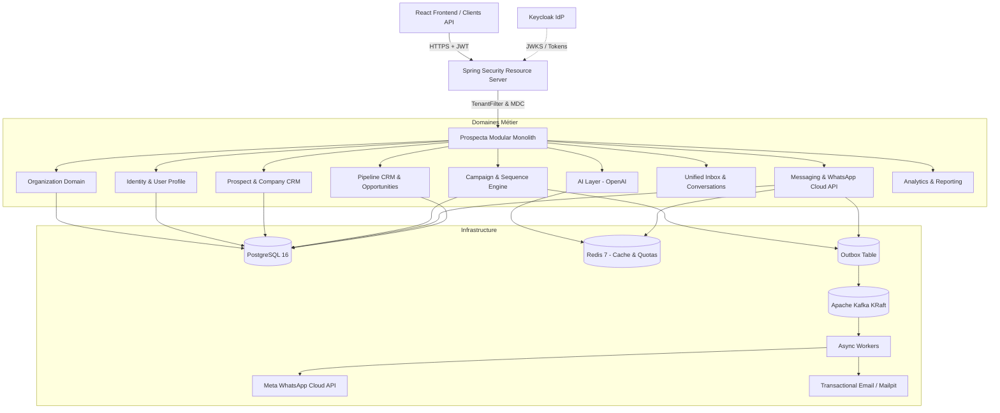

# Prospecta Backend — SaaS B2B Sales Automation

Prospecta est une plateforme SaaS B2B de prospection commerciale et d'automatisation des ventes multicanale (WhatsApp Business, Email, SMS) conçue pour le marché sénégalais et l'Afrique francophone.

---

## 1. Architecture Globale

L'architecture est un **Modular Monolith orienté Domain-Driven Design (DDD)** avec isolation multi-tenant stricte (`organization_id` systématique), authentification Keycloak OpenID Connect / JWT et asynchronisme fiable via Outbox Pattern et Apache Kafka.



---

## 2. Prérequis

* **Java** : JDK 21+
* **Maven** : 3.9+
* **Docker & Docker Compose** : pour l'environnement local (PostgreSQL, Redis, Kafka, Keycloak, Mailpit)

---

## 3. Démarrage Rapide en Local

### Étape 1 : Cloner le dépôt et configurer les variables
```bash
cp .env.example .env
```

### Étape 2 : Démarrer l'infrastructure avec Docker Compose
```bash
docker compose up -d
```
Les services suivants seront immédiatement disponibles :
* **PostgreSQL 16** : `localhost:5435` (`prospecta_db` / `prospecta` / `prospecta_dev_password`)
* **Redis 7** : `localhost:6379`
* **Apache Kafka (KRaft)** : `localhost:9092`
* **Keycloak 24** : `http://localhost:8081` (Admin: `admin` / `admin`) avec le realm `prospecta` pré-importé
* **Mailpit (Email dev)** : `http://localhost:8025` (Web UI) et `localhost:1025` (SMTP)

### Étape 3 : Compiler et exécuter les tests
```bash
mvn clean test
```

### Étape 4 : Lancer l'application
```bash
mvn spring-boot:run -Dspring-boot.run.profiles=local
```

L'API démarre sur `http://localhost:8080`.

---

## 4. Documentation OpenAPI / Swagger UI

* **Swagger UI** : [http://localhost:8080/swagger-ui.html](http://localhost:8080/swagger-ui.html)
* **OpenAPI Specs** : [http://localhost:8080/v3/api-docs](http://localhost:8080/v3/api-docs)
* **Health Check Actuator** : [http://localhost:8080/actuator/health](http://localhost:8080/actuator/health)

---

## 5. Norme des Réponses API

### Succès
```json
{
  "data": {
    "id": "c1f7...",
    "name": "Prospecta Demo",
    "slug": "prospecta-demo",
    "country": "SN",
    "currency": "XOF"
  },
  "meta": {}
}
```

### Erreur (Strictement normalisée, sans fuite d'information)
```json
{
  "error": {
    "code": "ORGANIZATION_NOT_FOUND",
    "message": "Organization not found with ID: c1f7...",
    "traceId": "9b12f6a73c4d8e90",
    "details": []
  }
}
```

---

## 6. Structure des Rôles & Sécurité Multi-Tenant

* `SUPER_ADMIN` : Administration globale de la plateforme Prospecta.
* `ORG_ADMIN` : Administrateur du workspace / organisation.
* `SALES_MANAGER` : Gestionnaire des campagnes, prospects et équipes.
* `SALES_REP` : Commercial exécutant (prospects assignés, conversations).
* `VIEWER` : Accès en lecture seule.

L'accès inter-organisations est strictement interdit : toute tentative d'accès aux données d'une organisation tierce est bloquée par `TenantFilter` et `TenantContextHolder` avec un code `403 FORBIDDEN`.
