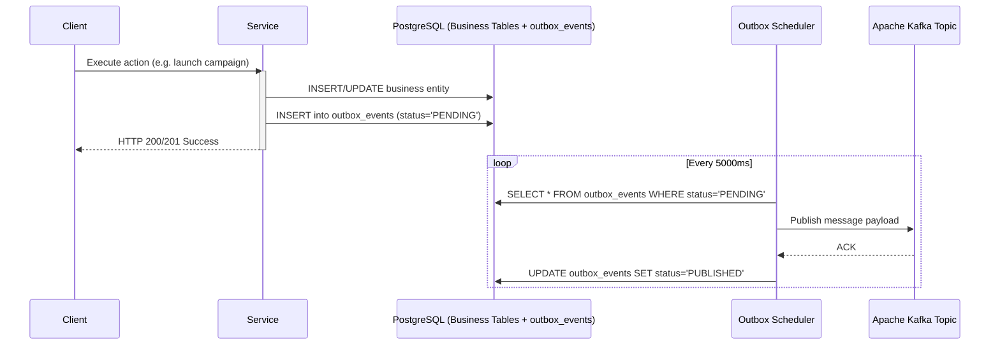

# Prospecta Backend — Architectural Overview

## 1. Executive Summary

Prospecta is a multi-tenant B2B Sales Automation and Lead Intelligence SaaS platform initially optimized for the Senegalese and West African business ecosystem (+221, Franc CFA / XOF, Africa/Dakar timezone).

The system adopts a **Modular Monolith** architecture governed by Domain-Driven Design (DDD) principles, combining the developer velocity and transactional guarantees of a unified codebase with clean domain boundaries, asynchronous messaging via Apache Kafka, and strict multi-tenant data isolation.

---

## 2. Technology Stack

| Layer / Concern | Technology | Version | Rationale |
| :--- | :--- | :--- | :--- |
| **Runtime & Language** | Java | 21 LTS | Virtual threads readiness, pattern matching, record types |
| **Framework** | Spring Boot | 3.3.3 | Enterprise maturity, native JPA 3.1 & OAuth2 Resource Server |
| **Database** | PostgreSQL | 16 | ACID compliance, JSONB support, robust relational indexing |
| **Migrations** | Flyway | 10.x | Deterministic, versioned schema management across environments |
| **Cache & Distributed Locks** | Redis | 7-alpine | Token blacklist, idempotency caching, distributed coordination |
| **Message Broker** | Apache Kafka | 3.7 (KRaft) | Asynchronous event streaming, transactional outbox consumer |
| **Identity & Access** | Keycloak | 24.0.5 | OpenID Connect, OAuth2 JWT issuer, centralized RBAC |
| **Telephony Parsing** | libphonenumber | 8.13.43 | Standard E.164 normalization for Senegalese mobile operators |
| **API Contract & Docs** | SpringDoc OpenAPI | 2.6.0 | Swagger UI and OpenAPI 3 schema auto-generation |

---

## 3. Package & Module Structure

The application code resides under `com.prospecta` and is organized into autonomous business domains:

```
com.prospecta/
├── shared/                       # Cross-cutting concerns & foundational framework
│   ├── audit/                    # Synchronous & async audit logging
│   ├── config/                   # Global Spring configurations (Kafka, Redis, Async)
│   ├── domain/                   # BaseEntity, TenantAwareEntity
│   ├── dto/                      # ApiResponse, ApiErrorResponse, PageResponse
│   ├── exception/                # GlobalExceptionHandler & Business exceptions
│   ├── outbox/                   # Transactional Outbox pattern implementation
│   ├── security/                 # Keycloak JWT converter, TenantFilter, SecurityConfig
│   └── utils/                    # PhoneNumberUtils, SsrfValidator
├── organization/                 # Tenant lifecycle & settings
│   ├── domain/                   # Organization, OrganizationPlan, OrganizationStatus
│   ├── dto/                      # Organization DTOs
│   ├── repository/               # OrganizationRepository
│   ├── service/                  # OrganizationService (with tenant validation)
│   └── controller/               # OrganizationController (/api/v1/organizations)
├── identity/                     # User management & Keycloak synchronization
│   ├── domain/                   # UserProfile, UserRole, UserStatus
│   ├── repository/               # UserProfileRepository
│   ├── service/                  # UserProfileService
│   └── controller/               # UserProfileController (/api/v1/users)
├── prospect/                     # CRM Core & Lead Intelligence
│   ├── domain/                   # Prospect, Company, IdealCustomerProfile (ICP)
│   ├── repository/               # ProspectRepository, CompanyRepository, IcpRepository
│   ├── service/                  # ProspectService, CompanyService, LeadScoringEngine, ProspectImportService
│   └── controller/               # ProspectController, CompanyController, IcpController
├── ai/                           # AI Copilot & Web Intelligence
│   ├── domain/                   # AiPromptTemplate, AiUsage
│   ├── provider/                 # AiProvider interface, OpenAiProvider (+ smart fallback)
│   ├── service/                  # CompanyAnalysisService, ProspectSummaryService, QuotaService
│   └── controller/               # AiController (/api/v1/ai)
├── campaign/                     # Multichannel Sequence Engine
│   ├── domain/                   # Campaign, CampaignStep, CampaignProspect, ChannelType
│   ├── repository/               # CampaignRepository, CampaignStepRepository, CampaignProspectRepository
│   ├── service/                  # CampaignService, CampaignExecutionService, CampaignScheduler
│   └── controller/               # CampaignController (/api/v1/campaigns)
├── messaging/                    # Omnichannel Messaging & Webhooks
│   ├── domain/                   # Message, CommunicationConsent, ExternalEvent
│   ├── provider/                 # MessagingProvider, WhatsAppMessagingProvider, EmailMessagingProvider
│   └── service/                  # MessagingService, ConsentService
├── conversation/                 # Unified Inbox & Conversational Intelligence
│   ├── domain/                   # Conversation, ConversationMessage, ConversationStatus
│   ├── repository/               # ConversationRepository, ConversationMessageRepository
│   ├── service/                  # ConversationService (auto-replied transitions, AI suggestions)
│   └── controller/               # ConversationController (/api/v1/conversations)
├── pipeline/                     # Sales CRM Deals & Opportunities
│   ├── domain/                   # Opportunity, OpportunityStage
│   ├── repository/               # OpportunityRepository
│   ├── service/                  # PipelineService
│   └── controller/               # OpportunityController (/api/v1/pipeline)
└── analytics/                    # Performance Metrics & Reporting
    ├── dto/                      # AnalyticsOverviewResponse, CampaignAnalyticsResponse
    ├── service/                  # AnalyticsService
    └── controller/               # AnalyticsController (/api/v1/analytics)
```

---

## 4. Transactional Outbox Pattern

To eliminate distributed dual-write inconsistencies between the relational database and Kafka, all state mutations and domain events record an `OutboxEvent` entity within the same local database transaction.



---

## 5. Database Schema & Flyway Migrations

Migrations follow sequential ISO timestamps in `src/main/resources/db/migration/`:

1. `V20260907100000__CREATE_ORGANIZATIONS.sql`
2. `V20260907101000__CREATE_USERS_AND_PROFILES.sql`
3. `V20260907102000__CREATE_COMPANIES.sql`
4. `V20260907103000__CREATE_PROSPECTS.sql`
5. `V20260907103500__CREATE_ICP_AND_SCORING.sql`
6. `V20260907104000__CREATE_AI_TEMPLATES_AND_USAGE.sql`
7. `V20260907105000__CREATE_CAMPAIGNS_AND_STEPS.sql`
8. `V20260907106000__CREATE_MESSAGING_AND_CONSENT.sql`
9. `V20260907107000__CREATE_CONVERSATIONS.sql`
10. `V20260907108000__CREATE_PIPELINE_AND_OPPORTUNITIES.sql`
11. `V20260907109000__CREATE_AUDIT_AND_OUTBOX.sql`
12. `V20260907109500__CREATE_EXTERNAL_EVENTS_AND_IDEMPOTENCY.sql`
