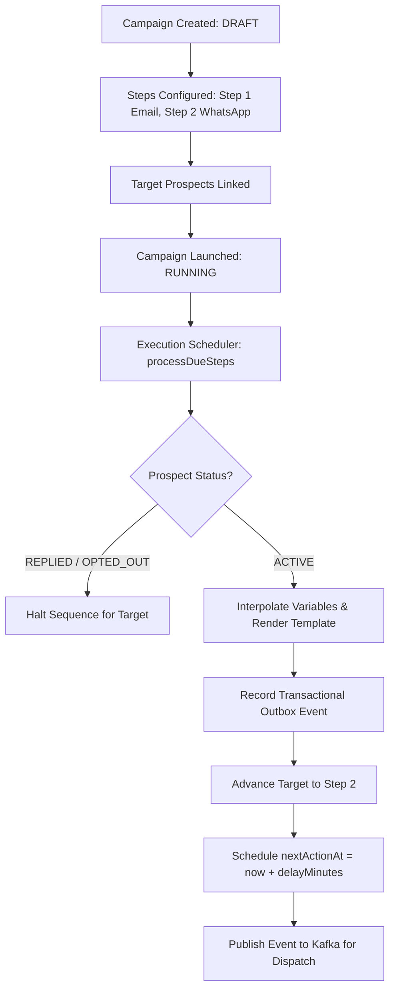

# Prospecta Backend — Campaign & Sequence Engine

## 1. Sequence Engine Architecture

Prospecta's sequence engine enables commercial teams to build automated, multi-touch, multichannel outreach sequences (Email, WhatsApp Business, SMS) with dynamic timing and stop conditions.



---

## 2. Sequence Entities & Data Model

### 2.1 `Campaign`
- `name`: Campaign label (e.g. "Campagne Directeurs Hôtels Dakar 2026")
- `channelStrategy`: Strategy type (e.g. `MULTI_CHANNEL`, `WHATSAPP_ONLY`, `EMAIL_ONLY`)
- `status`: `DRAFT` $\to$ `RUNNING` $\to$ `PAUSED` $\to$ `COMPLETED`
- `steps`: Ordered list of `CampaignStep`

### 2.2 `CampaignStep`
- `position`: 1-based order in sequence (1, 2, 3...)
- `channel`: `ChannelType` (`EMAIL`, `WHATSAPP`, `SMS`)
- `delayMinutes`: Relative delay from previous step execution (e.g., 0 for initial touch, 2880 for 48-hour follow-up)
- `subjectTemplate`: Email subject template (supports dynamic tags like `{{firstName}}`, `{{companyName}}`)
- `contentTemplate`: Message body template
- `enabled`: Boolean toggle to skip or activate steps dynamically

### 2.3 `CampaignProspect`
- `campaign_id` & `prospect_id`
- `status`: `PENDING` $\to$ `ACTIVE` $\to$ `PAUSED` $\to$ `REPLIED` $\to$ `COMPLETED` $\to$ `OPTED_OUT` $\to$ `FAILED`
- `current_step`: Integer pointer to the active step position
- `next_action_at`: Timestamp when the step becomes eligible for execution

---

## 3. Execution & Scheduling Engine

### 3.1 Polling & Execution (`CampaignExecutionService`)
1. An asynchronous cron or periodic task invokes `CampaignExecutionService.executeDueSteps()` every 30 seconds.
2. The query selects due targets:
   ```sql
   SELECT cp FROM CampaignProspect cp
   JOIN cp.campaign c
   WHERE c.status = 'RUNNING'
     AND cp.status = 'ACTIVE'
     AND cp.nextActionAt <= CURRENT_TIMESTAMP
   ```
3. For each due target:
   - **Condition Check**: If the associated `Prospect` has transitioned to `REPLIED` or `OPTED_OUT`, the target sequence is terminated immediately:
     $$\text{Target Status} \leftarrow \text{REPLIED} \quad \text{and} \quad \text{completedAt} \leftarrow \text{now()}$$
   - **Variable Interpolation**: Replaces placeholders (`{{firstName}}`, `{{lastName}}`, `{{companyName}}`, `{{jobTitle}}`) with prospect attributes.
   - **Outbox Event**: Emits a transactional `message.send.requested` event via `OutboxService`.
   - **Step Progression**: Advances `current_step` to `position + 1` and calculates:
     $$\text{nextActionAt} \leftarrow \text{now()} + \text{delayMinutes}$$
   - If no subsequent step exists, marks the target as `COMPLETED`.

---

## 4. Automatic Stop Conditions (Golden Path Step 16 & 17)

When a prospect responds through any channel (e.g. Meta WhatsApp webhook):
1. `ConversationService.recordInboundMessage()` immediately transitions `Prospect.status` to `REPLIED`.
2. Upon subsequent execution cycles, `CampaignExecutionService` identifies the prospect's `REPLIED` status and skips any planned follow-ups.
3. This guarantees that automated sequences never annoy interested prospects who are already actively engaging with sales reps.
