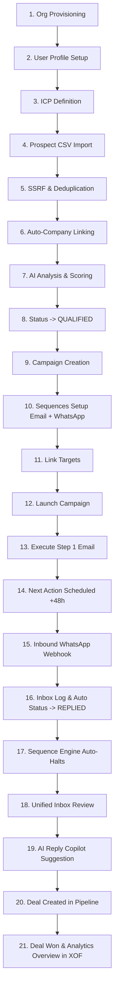

# Prospecta Backend — The 21-Step Commercial Golden Path

This document walks through the complete, end-to-end commercial workflow implemented and automated within Prospecta Backend for the Senegalese & West African market.

---

## The 21 Steps Walkthrough

---

### Phase I: Onboarding & Tenant Setup
1. **Organization Creation**: Provision tenant `"Teranga Digital Solutions"` (country: `SN`, currency: `XOF`, timezone: `Africa/Dakar`, plan: `STARTER`).
2. **User Profile Setup**: Assign sales administrator role `ORG_ADMIN` linked to Keycloak subject.
3. **Ideal Customer Profile (ICP) Definition**: Configure target sectors (`Hôtellerie`, `Tourisme`, `E-commerce`), target countries (`SN`), company sizes (`10-200`), minimum score (`70`).

### Phase II: Lead Ingestion & Qualification
4. **Prospect Import**: Ingest contact details with Senegalese phone formatting (`+221 77 123 45 67`).
5. **Phone Normalization & SSRF Validation**: E.164 normalization produces `+221771234567`. `SsrfValidator` blocks localhost and private ranges (`169.254.169.254`).
6. **Auto-Company Linking**: Resolves or auto-creates company `"Hôtel Teranga Dakar"` and associates with prospect `"Fatou Sow"`.
7. **AI Lead Scoring Engine**:
   - Location fit (Senegal / Dakar): **+20**
   - Senegalese mobile / WhatsApp prefix: **+25**
   - Professional email provided: **+15**
   - Decision maker keyword (`"Directrice Générale"`): **+30**
   - Total Score: **90 / 100** (Level: `VERY_HIGH`).
8. **Status Progression**: Prospect advances to `QUALIFIED`.

### Phase III: Campaign Orchestration
9. **Campaign Creation**: Setup `"Campagne Hôtels Dakar 2026"` with `MULTI_CHANNEL` strategy.
10. **Sequence Steps Setup**:
    - **Step 1 (Position 1)**: `EMAIL` with template subject `"Optimisation de vos réservations directes - {{companyName}}"`, delay: `0` min.
    - **Step 2 (Position 2)**: `WHATSAPP` with template `"Bonjour {{firstName}}, suite à notre email..."`, delay: `2880` min (48h).
11. **Target Prospect Linkage**: Add prospect to campaign target list (status: `ACTIVE`).
12. **Campaign Launch**: Campaign status transitions to `RUNNING`.
13. **Step 1 Execution**: Personalized email payload is rendered and dispatched; a transactional event is recorded in `outbox_events`.
14. **Sequence Advancement**: Target current step advances to `2`, and `nextActionAt` is scheduled for 48 hours later.

### Phase IV: Inbound Webhook & Unified Inbox
15. **Inbound WhatsApp Message**: Prospect replies via WhatsApp: `"Bonjour Aminata, nous souhaitons automatiser nos réservations. Pouvons-nous échanger jeudi à 11h ?"`.
16. **Inbound Message & Auto-Transition to `REPLIED`**: Webhook checks idempotency in `external_events`, appends message to Unified Inbox thread, and **automatically transitions prospect status from `CONTACTED` to `REPLIED`**.
17. **Automated Sequence Halting**: The campaign sequence engine detects that the prospect has replied and automatically suppresses any future follow-up steps for this contact.
18. **Unified Inbox Consultation**: Sales representative queries conversation thread at `/api/v1/conversations/{id}`.
19. **AI Reply Copilot (`CONVERSATION_REPLY_V1`)**: Copilot analyzes conversation history and generates structured French reply suggestion: `"Bonjour Madame Sow, c'est noté avec grand plaisir ! Je bloque ce jeudi à 11h pour notre démonstration."` (Intent: `DEMO_REQUEST`, Confidence: `0.98`).

### Phase V: CRM Pipeline & Analytics
20. **Deal / Opportunity Creation**: Sales deal created in pipeline (`"Hôtel Teranga - Licence Annuelle"`, stage: `MEETING_SCHEDULED`, value: `3,500,000` XOF). Prospect status updates to `OPPORTUNITY`.
21. **Opportunity Won & Analytics**: Opportunity stage updated to `WON`:
    - `winProbability` reaches `100%`.
    - Prospect status updates to `WON`.
    - Real-time Analytics overview reflects:
      - `opportunitiesWon`: **1**
      - `totalWonValue`: **3,500,000 XOF**
      - `replyRate`: **100.0%**
      - `conversionRate`: **100.0%**
