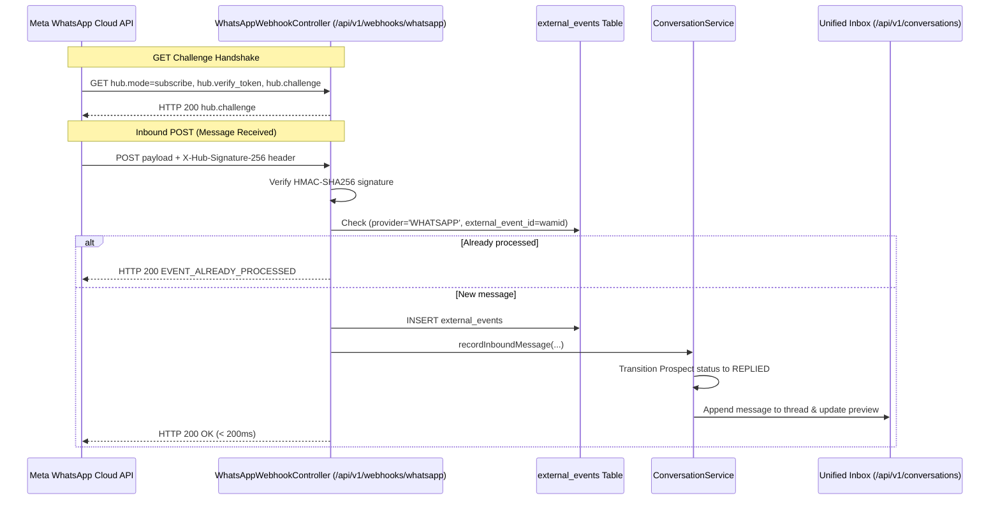

# Prospecta Backend — Meta WhatsApp Business Cloud API & Unified Inbox

## 1. Integration Strategy

Prospecta interfaces directly with the **official Meta WhatsApp Business Cloud API** (Graph API v19.0+). 

> [!WARNING]
> Unofficial WhatsApp Web scrapers, Puppeteer browser bots, or reverse-engineered client libraries are strictly prohibited due to ban risks, lack of SLA, and violation of Meta Terms of Service.

---

## 2. Webhook Architecture

---

## 3. Webhook Endpoints

### 3.1 Verification Handshake (`GET /api/v1/webhooks/whatsapp`)
Meta sends verification parameters when registering the webhook URL:
- `hub.mode`: `"subscribe"`
- `hub.verify_token`: Must match configured `prospecta.whatsapp.verify-token`
- `hub.challenge`: Echoed back as plain text with HTTP 200.

### 3.2 Inbound Event Processor (`POST /api/v1/webhooks/whatsapp`)
Processes messages, delivery receipts (`sent`, `delivered`, `read`), and failures:
- Computes SHA256 HMAC of raw body with `appSecret`.
- Extracts `wamid` (`entry[0].changes[0].value.messages[0].id`).
- Checks idempotency table `external_events`.
- Maps sender number (`from`) to an existing prospect by matching `whatsapp_number` or normalized `phone`.
- Records message in `conversation_messages`.
- Automatically shifts `Prospect.status` from `CONTACTED` to `REPLIED`.

---

## 4. Unified Inbox & AI Reply Copilot

### 4.1 Unified Thread Management
- Multi-channel aggregation: WhatsApp and Email messages are presented in a unified conversational timeline per prospect.
- Real-time previews: `conversations.last_message_preview` and `last_message_at` enable instant inbox sorting.

### 4.2 AI Reply Copilot (`POST /api/v1/conversations/{id}/ai/reply`)
When a commercial agent opens an inbound prospect message:
1. The service gathers the full conversation thread history.
2. Formats the `CONVERSATION_REPLY_V1` prompt template:
   - Injects prospect identity, company name, and conversation history.
   - Constrains response to structured JSON.
3. Calls the AI provider (`OpenAiProvider`).
4. Deducts monthly quota via `QuotaService` and logs audit events.
5. Returns a structured `AiReplySuggestion`:
   - `suggestedReply`: Professionally phrased response in French tailored for Senegal.
   - `intent`: Classified intent (`INTERESTED`, `DEMO_REQUEST`, `PRICE_QUERY`, `OBJECTION`).
   - `sentiment`: `POSITIVE` / `NEUTRAL` / `NEGATIVE`.
   - `recommendedNextAction`: `BOOK_MEETING`, `SEND_PROPOSAL`, `CREATE_OPPORTUNITY`.
   - `confidence`: Score (0.0 to 1.0).
